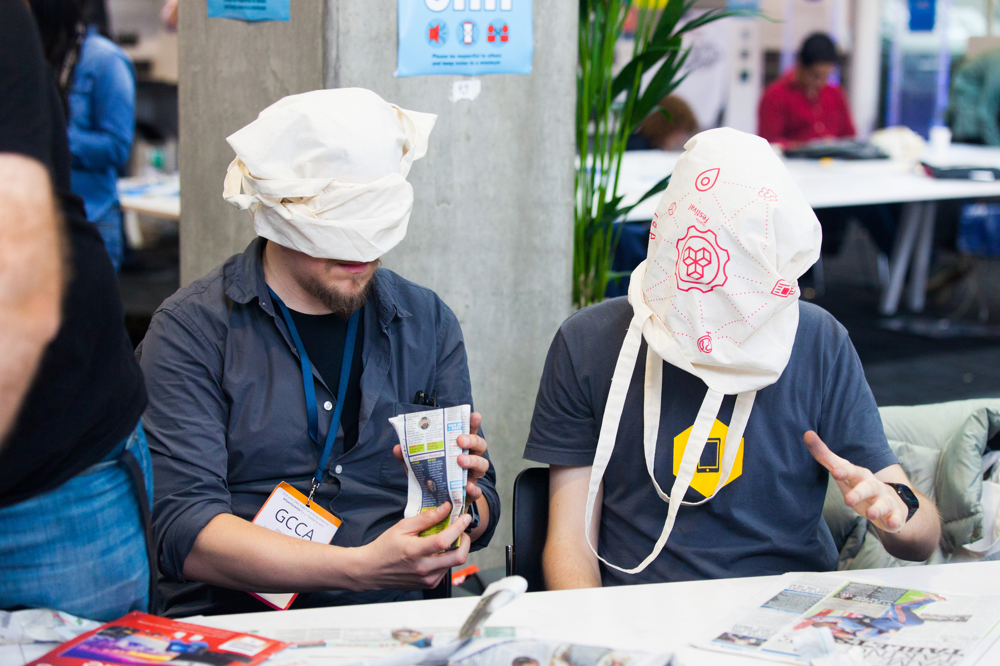

# Bridge Building

Learners will use the Internet to solve the mystery of The Kraken, a legendary sea creature, while also **learning about search terms, keywords, and how to assess the validity and relevance of web sources.**

It lasts about 45 minutes to a hour

You can [view this activity online](http://dricupello.github.io/activity-bridge-building).

